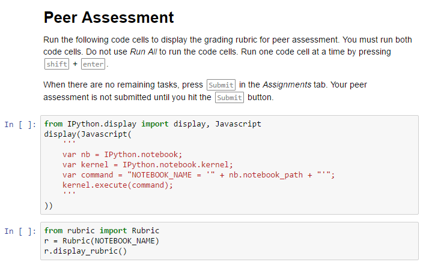
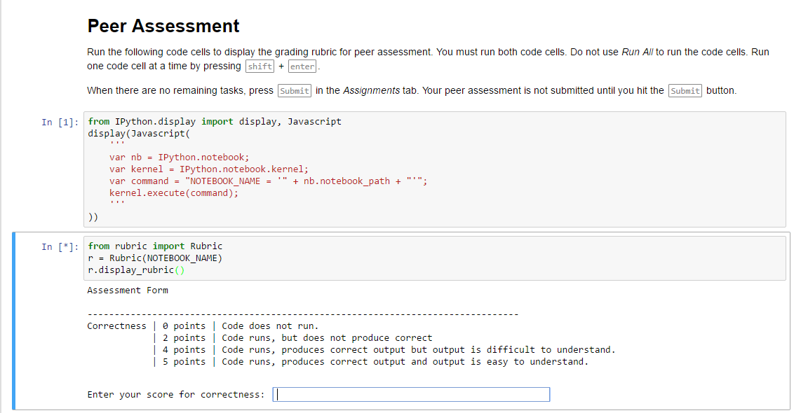
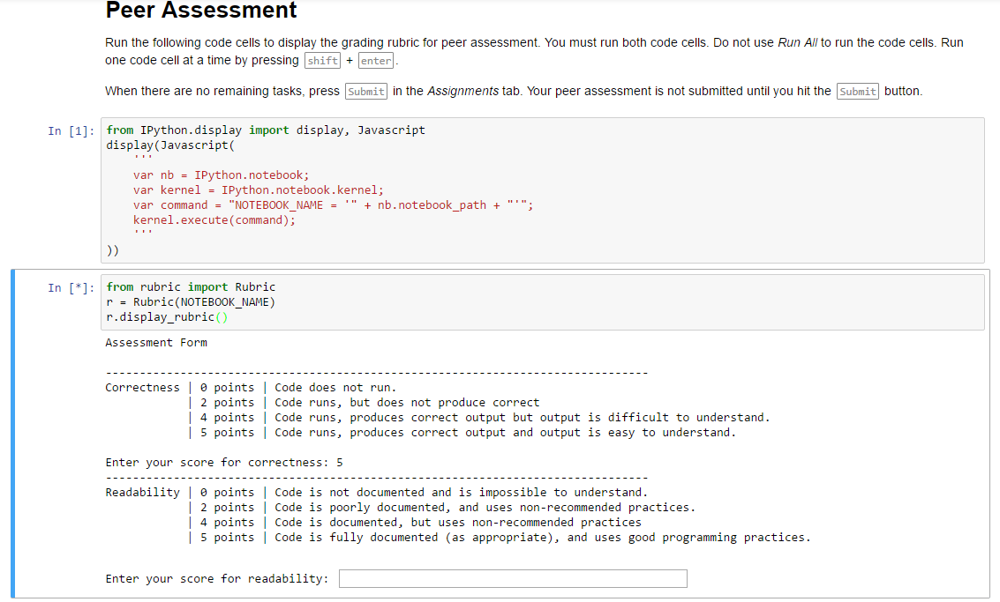
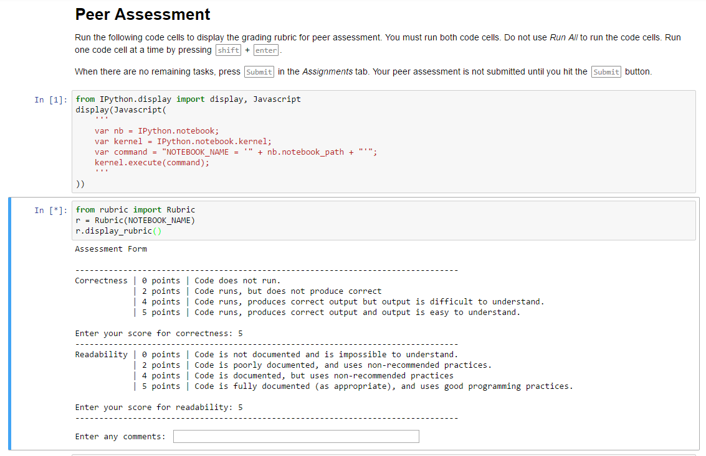
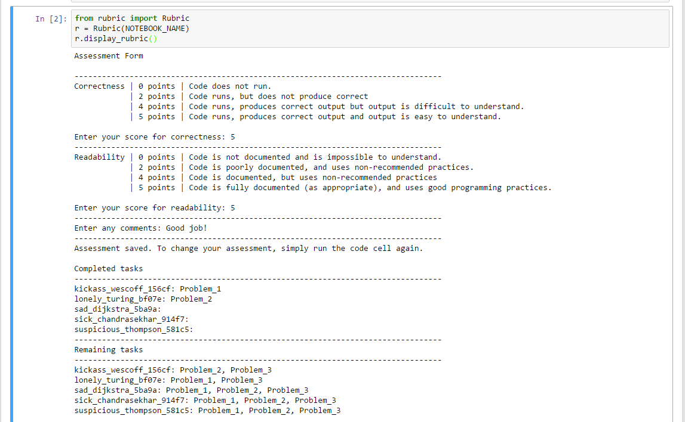

# Correctly Completing Peer Grading

In order to properly complete and submit the grades that you assign to your peers, you must follow the following steps:
1.  After retrieving the Peer_Review Assignment from the Assignment tab, open up your first notebook that you want to grade.

2.  Run the code cells one at a time by pressing `shift`+ `enter`, paying attention to the output of the code, how well the code was written, etc.

3.  When you get to the bottom of the notebook you are grading, you should see the following cells:

4.  After running the first and second of these code cells by pressing `shift`+`enter` twice, you should see the following:

5.  Type in the appropriate grade into the box and then press enter.  This will bring up a second input box:

6.  Once again, type in the appropriate grade into the box and press enter.  This will bring up a comments box:

7.  Type in any comments that you would want your peer to see and then press enter.  Once you have done this you should see this:

8.  Once you see the above message, then you can save and then shut down the notebook and move on to grading the other notebooks in a similar fashion.  Once you are done grading all of your notebooks, make sure to press `Submit` in the Assignment tab so that you will recieve a grade for Peer Grading!

