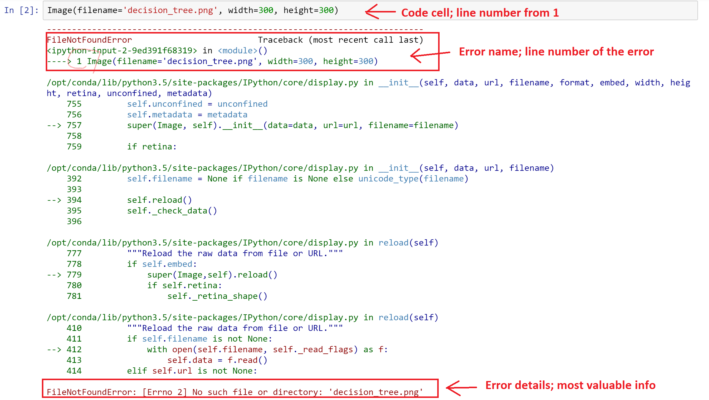
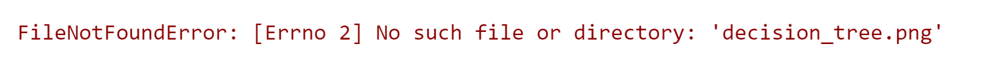
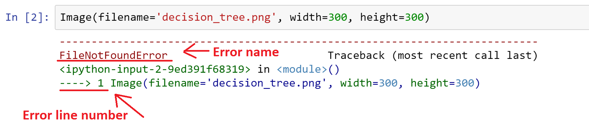
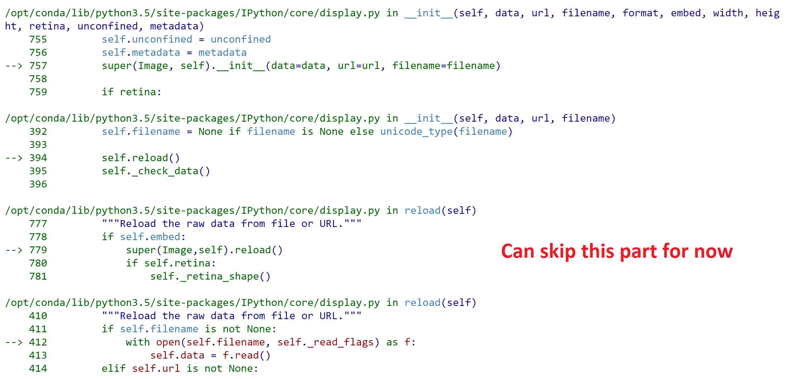
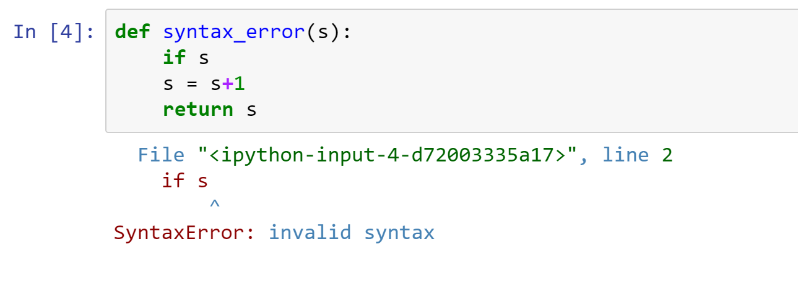
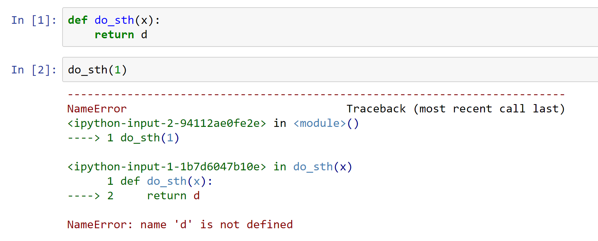
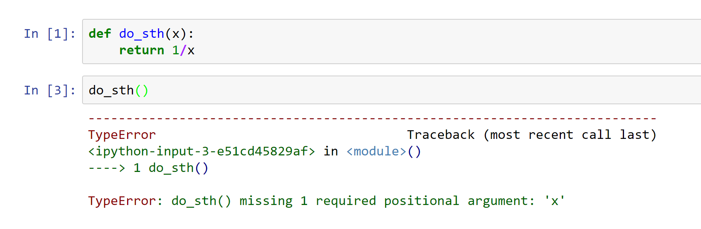
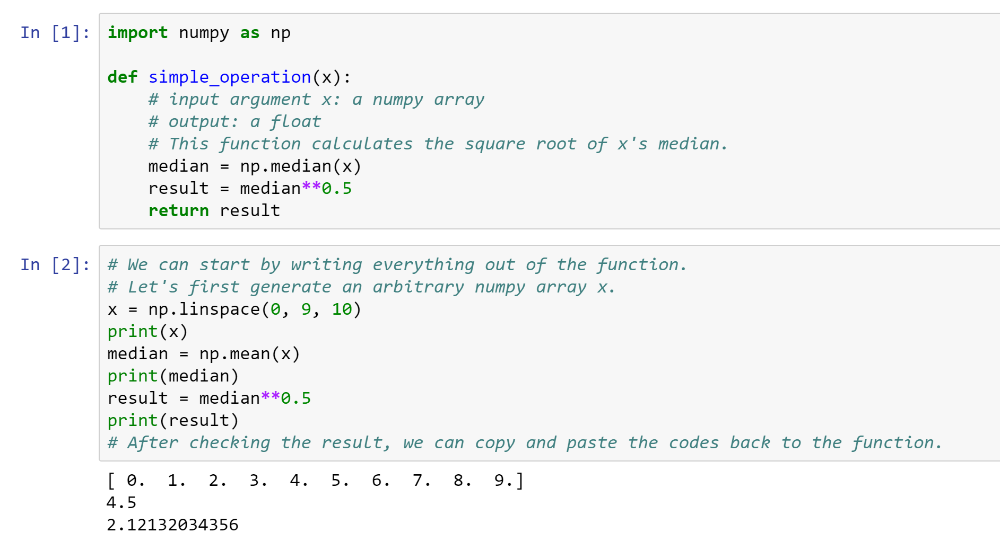

# How to read Python error messages

Python error messages give important information to debug your code. Here are some tips to read and understand of Python error tracebacks. *No.2 and No.3 are must-read tips if you do not have time to read through.* Let's take the error message below as an example. 

0. DON'T PANIC! Python often gives quite long error messages, but we do not need to understand all the lines most of the time.

1. Read *the last line* first. The very last line tells you exactly what the problem is in your codes. It is like a conclusion that Python draws in the end, and it is usually human-readable. In the example, the last line of the error messages is `FileNotFoundError: [Errno 2] No such file or directory: 'decision_tree.png'`. Clearly, the cell is not able to run because Python is not able to find a file named `decision_tree.png`, so either we do not have that file, or we give Python a wrong file directory.

2. The first part of the error message tells you *at which line* the code cell fails. The error message starts with a "title" that gives you the name of the execption, in this case `FileNotFoundError`, which is explained in detail in the last line. The error "title" is often the best key word to search in google if you do not know how to solve it. What is more important in the first part is the number after the `---->` arrow. That number is the line number in the cell above the message where the iPython notebook stops due to an execption. That line is where you need to fix. Note: the line number is within the cell, note the entire notebook.

3. The middle parts can be skipped for now. Basically, those lines tell you deeper why the error raises, tracing back to Python builtin modules. For this class, you do not have to read and understand those parts. You need to care about the `---->` arrow only, not `-->` arrows. But if you are interested, feel free to dig them in details.

4. If your codes have more than 1 problem, the error message only gives you the first error the notebook has encountered because it stopps immediately the error eccurs. Don't be suprised if you rerun the cell and get a different error message after you have fixed a bug in the code cell.

5. A syntax error has the highest priority since the notebook stops before it tries to run. When you encounter a syntax error, check the spelling, case, quotation marks, parentheses, etc. Below is a syntax error example. It actually contains more than 1 error. See how Python reports the exception:

6. Errors in user-defined function: If there is an error in a user-defined function, unless it is a syntax error, python will not generate an error message in the cell of the function, because the function has not yet been executed. Python prints out the error message at the cell where the errorneous funtion is executed. In the error message, we are going to see two four-slash arrows (`---->`). As is shown in the example below, the first `---->` arrow tells you the line number in the cell where you try to run a funtion that has an error, and the second `---->` arrow tells you the line number in the cell where the function is created. For our assignments, the second `---->` arrow is more important in general. 

7. Tip 7 talks about the case that a function has an error but the line to execute the function does NOT has an error. If the code to call the user-defined function has an error, for example, a missing argument, then you still get one `---->` arrow instead of two. It is pretty much the same case as when you call a built-in Python function (as is discussed in tip 1-5). 

8. To write a complex function, you can start by assigning values to the input arguments, and write your codes outside the function. When you are done with the testing, just copy and paste your code inside the function and add a return statement. It is useful to print out the intermediate values if you are not confident about certain steps. Once you get more familiar with writing functions, you could work directly inside your function, but still, it is useful to either print out or return the intermediate variables so that you can debug. Other useful functions for debugging in addition to `print()` include: `type()`, `len()` for string and array-like objects.

9. As you should have noticed, the correct answers to the assignments are shown in the assertion test codes. For example, in Week 4 Problem 3, we have this line of code to test the `dict_from_lists()` function: `assert_equal(dict_from_lists([1, 2], ['1', '2']), {1: '1', 2: '2'})`. `assert_equal()` operates like an equation. In this example, `dict_from_lists([1, 2], ['1', '2'])` is the code to execute the funcion, and `{1: '1', 2: '2'}` is the answer. `assert_equal()` will complain if its two arguments do not match.

10. The tips may be updated in the future once I come up with more.

# How to ask good coding questions

If you have found what the error message is and where in the code it refers, but do not know how to solve it, consider searching google for the exact error message. Often times, this search will give you helpful information about where in your code to look for errors.  Alternately, you can search through the class forum to see if your peers have had similar issues which have been since resolved.

At times, googling an error and searching through the class forums does not return helpful information or any pertinent information at all.  In cases like these, it is important to know how to intelligently ask for help with your coding problems in the forums or in emails. So, when you ask for help with a coding problem, please keep in mind the following guidelines, paraphrased from "Automate the Boring Stuff with Python":

"""

1. Explain what you are trying to do, not just what you did. This lets your helper know if you are on the wrong track.

2. Specify the point at which the error happens. Does it occur at the very start of the program or only after you do a certain action?
Copy and paste the entire error message and your code (leave out the code if you are posting to the forums!)

3. Explain what you’ve already tried to do to solve your problem. This tells people you’ve already put in some work to figure things out on your own.

4. If the error came up after you made a change to your code, explain exactly what you changed.

5. Say whether you’re able to reproduce the error every time you run the program or whether it happens only after you perform certain actions. Explain what those actions are, if so.

6. Always follow good online etiquette as well. For example, don’t post your questions in all caps or make unreasonable demands of the people trying to help you.

"""

Now, obviously, in the class forums you cannot share code. Thus, please use your best judgement when getting help in the class forum, and censor your posts accordingly.

With these guidelines in place, it will make it much easier for your TAs and your classmates to help you on any problems you might encounter.
